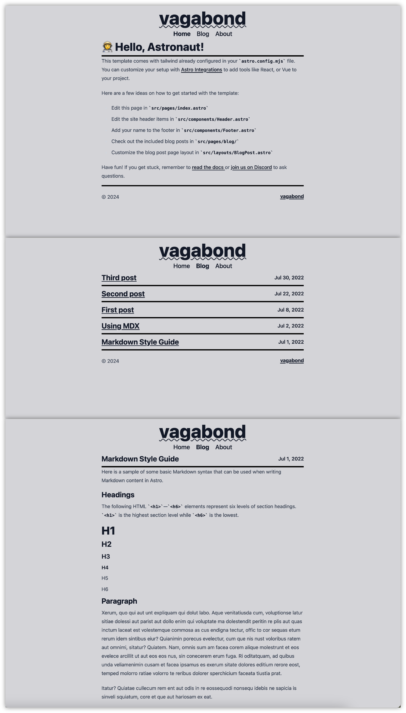

# Vagabond

## A minimal blog-focused theme for Astro!

### Live Example

https://astro-vagabond-theme.netlify.app

### Preview

### About

Vagabond is a lightweight minimal blog-focused theme for Astro that uses tailwind for quick inline styling. If you don't like to inline your tailwind, there is a `style.ts` file in the root directory to add lengthy stylings/styles used in more than one location.

In addition to tailwind, Vagabond also uses the typography to allow default html formatting when using html tags.

If you are unfamiliar with [tailwind](https://tailwindcss.com/docs/utility-first) or [typography](https://tailwindcss.com/docs/typography-plugin), the documentation is very good at getting the uninitiated up to speed.

### Modifications

Outside of the theme itself, CSS and hero images have been stripped out completely, but can easily be put back in if truly desired.

### Contributors

[greg pappas](https://github.com/gnprwx)

