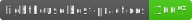
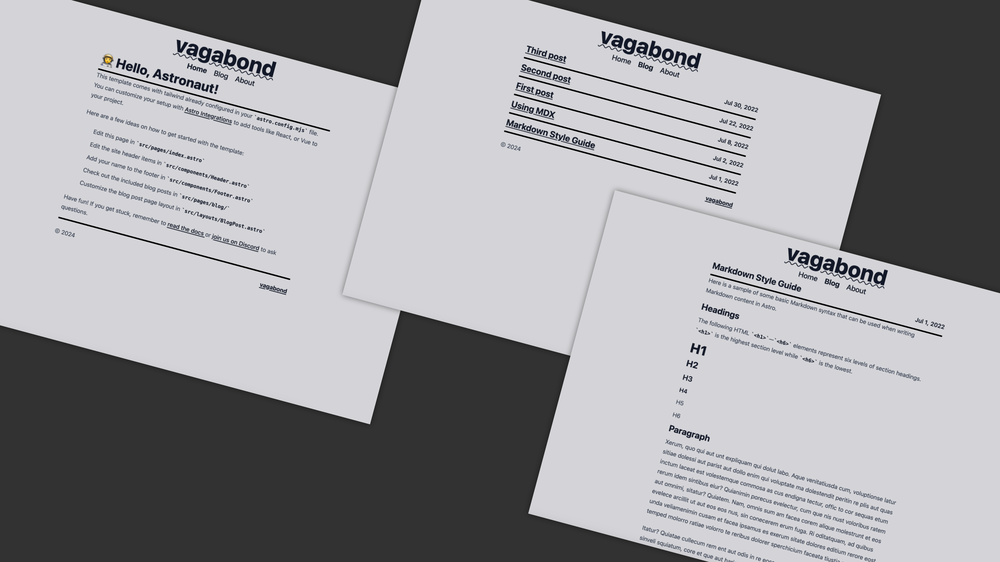

# vagabond

## A minimal blog-focused theme for Astro!

### Live Example

https://astro-vagabond-theme.netlify.app

### Preview

### About

Vagabond is a fast, minimal, responsive, and stripped-down theme for Astro and has a lighthouse score of 100 on both mobile and desktop views. If you like to customize the blog with your own look, you can quickly do so with tailwind. In addition to tailwind, vagabond also uses the typography plugin to allow default html formatting when using html tags.

If you are unfamiliar with [tailwind](https://tailwindcss.com/docs/utility-first) or [typography](https://tailwindcss.com/docs/typography-plugin), the documentation is very good at getting the uninitiated up to speed.

### Modifications

The newest blog post shows up first in the blog list instead of the default ascending behavior. Hero images do not show in the list of blog posts.

### Contributors

[greg pappas](https://github.com/gnprwx)

